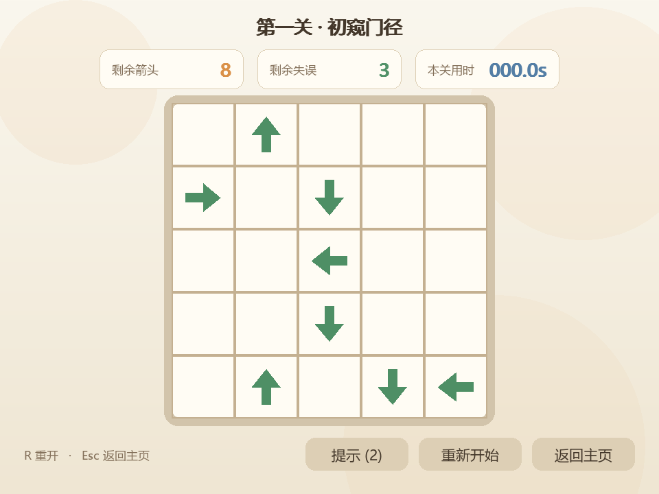
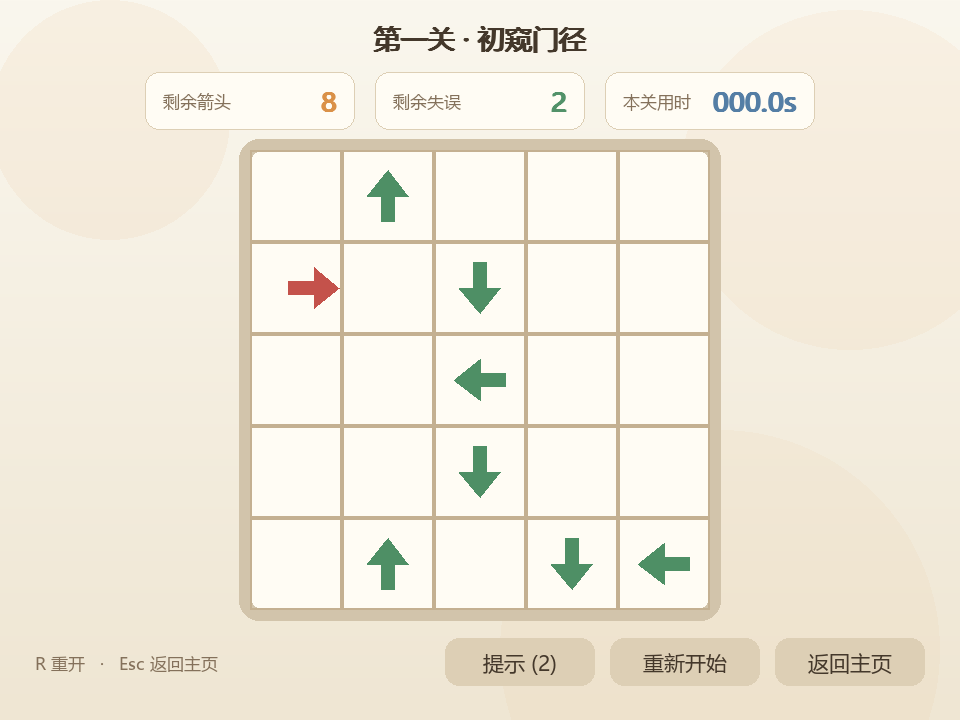
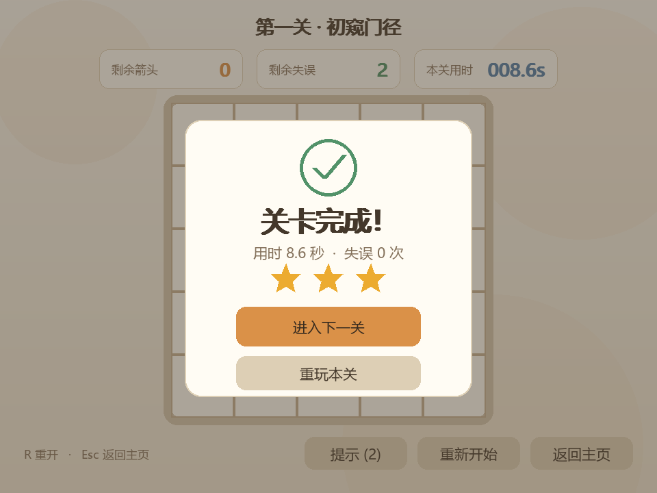
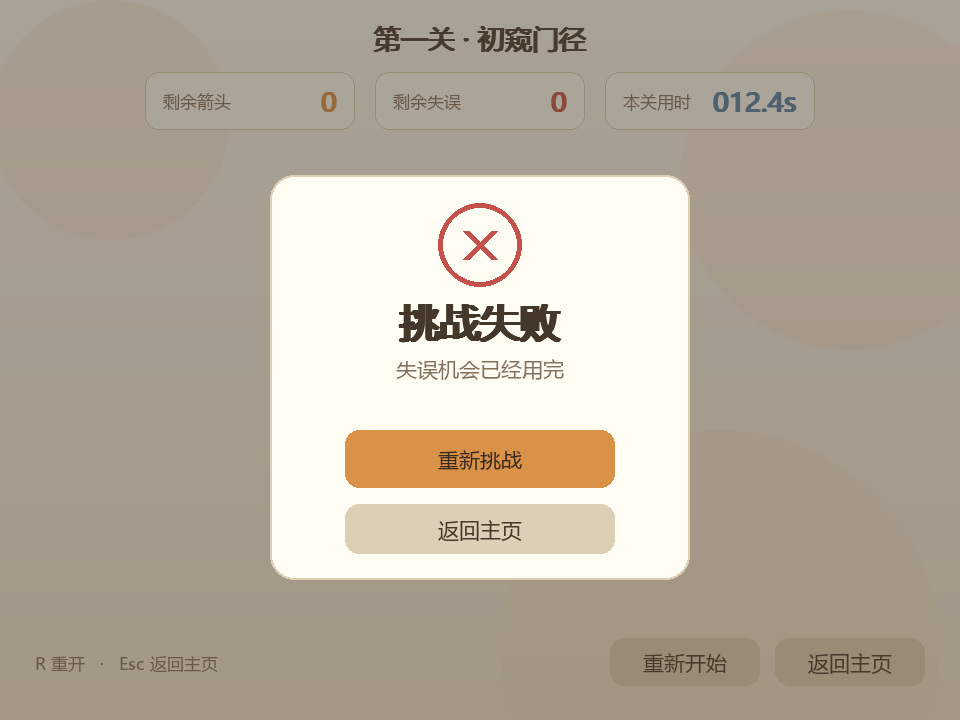

# 软件工程第二次个人作业——“一箭又一箭”小游戏

| 项目 | 内容 |
| --- | --- |
| 这个作业属于哪个课程 | [2026-01 软件工程与软件工程实践](https://edu.cnblogs.com/campus/fzu/2026-01SoftwareEngineeringandSoftwareEngineeringPractice) |
| 这个作业要求在哪里 | [第二次个人作业](https://edu.cnblogs.com/campus/fzu/2026-01SoftwareEngineeringandSoftwareEngineeringPractice/homework/16718) |
| 这个作业的目标 | 使用 Python 和 AIGC 完成“一箭又一箭”小游戏 |
| 姓名、学号 | 【待填写】 |
| GitHub 仓库 | 【待填写】 |

> 提交前请删除所有“【待填写】”提示，并将截图路径替换成上传到博客或 GitHub 后的公开图片地址。

## 一、项目展示

### 1. 开始界面


### 2. 游戏界面



### 3. 碰撞反馈



### 4. 通关与失败界面





## 二、项目介绍

“一箭又一箭”是一款点击式箭头解谜游戏。棋盘中放置了朝上、下、左、右四个方向的箭头。玩家需要观察箭头的朝向和相互阻挡关系，选择正确的消除顺序，最终清空棋盘。

- 前方没有其他箭头时，被点击的箭头会沿自身方向飞出棋盘。
- 前方存在其他箭头时，箭头会变红并回弹，同时扣除一次失误机会。
- 正确消除使用箭头飞出的短促“嗖”声，错误碰撞使用低沉警示音，玩家无需看文字也能区分操作结果。
- 清空当前关卡即可通关；失误机会耗尽则挑战失败。
- 游戏包含三个难度递增且经过求解器验证的关卡。
- 支持重新开始、返回主页以及 `R`、`Esc` 快捷键。

游戏使用 960×720 窗口，所有图形由 Pygame 直接绘制，两种音效由代码合成，不依赖外部图片或音频素材；音频设备不可用时会静默降级。

## 三、实现思路

### 1. 数据表示

关卡使用二维字符网格保存：`U`、`D`、`L`、`R` 分别代表四个方向，`.` 代表空格。方向通过 `(dr, dc)` 向量统一处理，避免为四个方向重复编写判断代码。

### 2. 路径检测

点击箭头后，从它前方的第一个格子开始，沿箭头方向一直扫描到棋盘边界。扫描过程中遇到任意箭头就判定为阻挡；没有遇到箭头并走出边界，则判定路径畅通。紧贴边缘且朝向棋盘外的箭头会直接判定为可消除，不会访问越界下标。

### 3. 状态与动画

规则层维护开始、游戏中、通关、失败和全部通关状态。界面层将规则结果转换为动画：成功时绘制一个沿方向加速离开的箭头，失败时绘制前冲、变红和回弹效果。动画期间锁定输入，避免连续点击产生重复判定。

### 4. 关卡可解性

项目内置 DFS 求解器。它会寻找当前所有能飞出的箭头，尝试移除后继续搜索，直到棋盘清空。自动化测试会对三关求解并重放整条点击序列，从而避免提交无法通关的关卡。

### 5. 操作音效

界面层通过标准 PCM 波形实时生成音效：正确操作使用滤波噪声叠加快速扫频，模拟箭头掠过空气的短促“嗖”声；错误操作使用频率较低并带有轻微颤动的警示音。两种声音在音色和节奏上明显不同，同时避免引入外部素材及版权问题。

## 四、AIGC 使用过程

请参考仓库中的 `AIGC_RECORD.md`，根据真实开发和修改过程补充。建议至少展示需求分析、架构设计、功能实现、问题修复和测试五个有代表性的阶段。

【待填写：粘贴整理后的真实 AIGC 使用表，并加入必要的对话截图】

## 五、测试结果

测试环境：Windows 11、Python 3.13、Pygame 2.6.1、pytest 8.4.2。

| 编号 | 测试内容 | 预期结果 | 实际结果 | 是否通过 |
| --- | --- | --- | --- | --- |
| T01 | 点击前方无阻挡的箭头 | 飞出棋盘并消失 | 【运行后填写】 | 【待填写】 |
| T02 | 点击前方有阻挡的箭头 | 保持原位，失误减一 | 【运行后填写】 | 【待填写】 |
| T03 | 点击边缘且朝外的箭头 | 正常消除，无越界异常 | 【运行后填写】 | 【待填写】 |
| T04 | 消除本关全部箭头 | 显示通关并可进入下一关 | 【运行后填写】 | 【待填写】 |
| T05 | 失误次数耗尽 | 显示失败并允许重开 | 【运行后填写】 | 【待填写】 |
| T06 | 游戏中重新开始 | 布局、失误和计时恢复 | 【运行后填写】 | 【待填写】 |

【待填写：粘贴 `pytest -v` 和 `scripts/selfcheck.py` 的实际输出或截图】

## 六、PSP 表格

请根据 `PSP_TEMPLATE.md` 填写真实的预估与实际耗时。

【待填写：完整 PSP 表格及差异分析】

## 七、心得体会

建议结合自己的真实经历回答：

1. AIGC 在需求分析、编码、测试中分别提供了什么帮助？
2. 哪些 AI 生成内容存在问题，你如何发现并修改？
3. 你是否理解路径检测、状态切换和动画锁定的实现？
4. 自动化测试或求解器是否帮助你发现了关卡问题？
5. 完成项目后，你对软件工程过程有什么新的认识？

【待填写：个人心得，建议使用自己的语言完成】

## 八、运行方式

```powershell
py -3.13 -m venv .venv
.\.venv\Scripts\python.exe -m pip install -r requirements.txt
.\.venv\Scripts\python.exe main.py
```

运行自动化测试：

```powershell
.\.venv\Scripts\python.exe -m pytest -v
```
