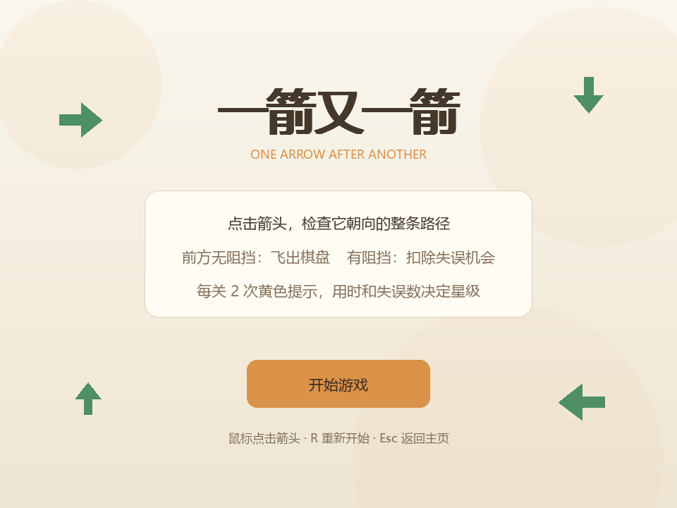
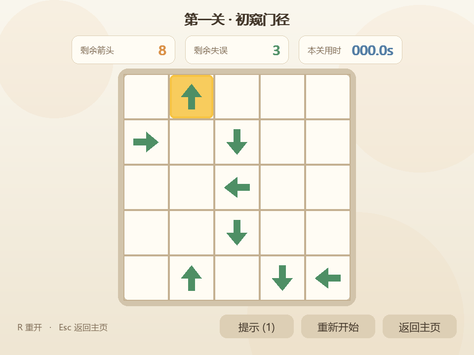
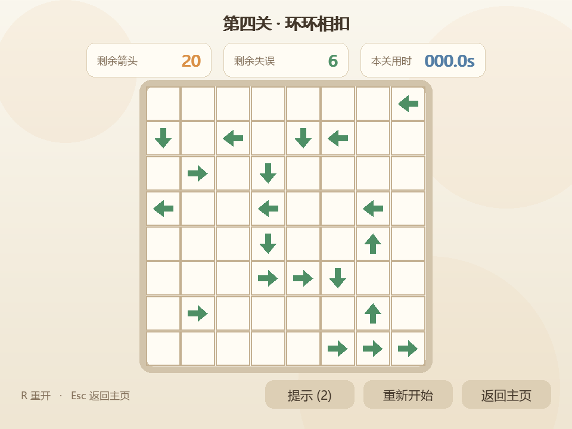

# 一箭又一箭

使用 Python 和 Pygame 实现的点击式箭头解谜游戏。项目包含四个递增难度关卡、两次提示、三星评分、动画反馈、失误机制和自动化测试。



## 游戏规则

- 棋盘上的箭头有上、下、左、右四种方向。
- 点击箭头时，程序会检查箭头前方直到棋盘边界的整条路径。
- 路径中没有其他箭头时，当前箭头会飞出棋盘并消失。
- 所有正常箭头统一显示为绿色；路径中存在其他箭头时，发生碰撞的箭头会变红、前冲抖动并回弹，同时扣除一次失误机会。
- 正确消除会播放箭头飞出的短促“嗖”声，错误碰撞会播放低沉警示音。
- 清空棋盘即可通过当前关卡；失误机会耗尽则挑战失败。
- 每关可使用 2 次提示，系统会用黄色高亮一个当前可正确点击的格子。
- 通关后根据用时和失误次数评定 1–3 星：零失误且达到快速时限为 3 星，一次以内失误且达到普通时限为 2 星，其余为 1 星。
- 四关棋盘依次为 5×5、6×6、7×7、8×8，分别包含 8、12、16、20 个箭头，并均经 DFS 求解器验证可通关。

## 环境与运行

推荐使用 Python 3.13。Windows PowerShell 下执行：

```powershell
py -3.13 -m venv .venv
.\.venv\Scripts\python.exe -m pip install -r requirements.txt
.\.venv\Scripts\python.exe main.py
```

也可以在已经安装依赖的环境中直接运行：

```powershell
python main.py
```

快捷键：

- `R`：重新开始当前关卡
- `Esc`：返回开始界面

## 测试和自检

```powershell
.\.venv\Scripts\python.exe -m pytest -v
.\.venv\Scripts\python.exe scripts/selfcheck.py
.\.venv\Scripts\python.exe scripts/capture_screenshots.py
```

截图脚本会在 `screenshots/` 中生成开始、游戏、提示、碰撞、通关、失败和第四关七种真实界面截图。

提示效果：



高难度扩展关：



## 项目结构

```text
.
├── arrow_game/
│   ├── core.py               # 纯规则层、状态管理和关卡求解器
│   ├── levels.py             # 三个基础关和一个扩展关的数据
│   └── ui.py                 # Pygame 界面、事件与动画
├── scripts/
│   ├── capture_screenshots.py
│   └── selfcheck.py
├── tests/                    # T01–T06 与补充自动化测试
├── BLOG_DRAFT.md             # 博客作业初稿
├── AIGC_RECORD.md            # AIGC 协作记录模板
├── PSP_TEMPLATE.md           # PSP 统计模板
├── main.py                   # 游戏入口
└── requirements.txt
```

## 核心算法

方向统一表示成 `(行变化量, 列变化量)`。路径检测从被点击箭头的下一格开始，沿方向逐格扫描：遇到存活箭头即判定为阻挡；坐标越过边界则说明路径畅通。

规则层不依赖 Pygame，因此可以单独测试。界面层只负责把鼠标位置转换成棋盘坐标、调用规则接口，以及根据 `REMOVED`、`BLOCKED`、`IGNORED` 三种结果播放对应动画。

项目还包含一个 DFS 求解器。测试会对四个关卡分别求解并逐步回放，确保所有内置关卡均能通关。第四关为 8×8 棋盘、包含 20 个箭头，开局仅有三个合法选择，求解路径中存在多个唯一选择步骤。

## 作业测试项

| 编号 | 测试内容 | 预期结果 |
| --- | --- | --- |
| T01 | 点击前方无阻挡的箭头 | 箭头飞出并消失 |
| T02 | 点击前方有阻挡的箭头 | 箭头保留，失误机会减一 |
| T03 | 点击位于边缘且朝外的箭头 | 正常消除且不越界 |
| T04 | 清空当前关卡 | 显示通关并可进入下一关 |
| T05 | 失误机会耗尽 | 显示失败并可重新开始 |
| T06 | 游戏中重新开始 | 棋盘、失误和计时全部恢复 |

## 说明

界面采用米白色暖色主题。项目所有图形均由 Pygame 绘图 API 生成，两种提示音由程序实时合成，不使用外部图片或音频素材。音频设备不可用时会自动静默降级，不影响正常游玩。提交前请在博客初稿中填写自己的姓名、学号、GitHub 地址、实际耗时、人工修改和心得，不要直接保留占位文字。
